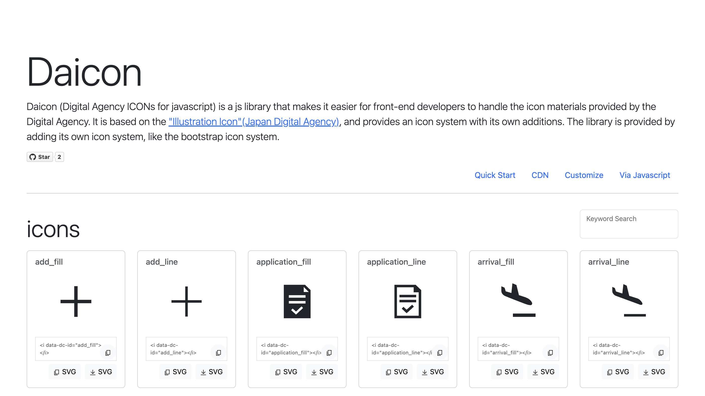

# daicon
Daicon.js (Digital Agency ICONs for javascrip) is a js library that makes it easier for front-end developers to handle the icon materials provided by the Digital Agency. It is based on the "Illustration Icon Materials" (Digital Agency) (https://www.digital.go.jp/policies/servicedesign/designsystem/Illustration_Icons/), and provides an icon system with its own additions. The library is provided by adding its own icon system.

# Getting Started
  * 

# Reference
 * "Illustration Icon Materials" (Digital Agency) (https://www.digital.go.jp/policies/servicedesign/designsystem/Illustration_Icons/
